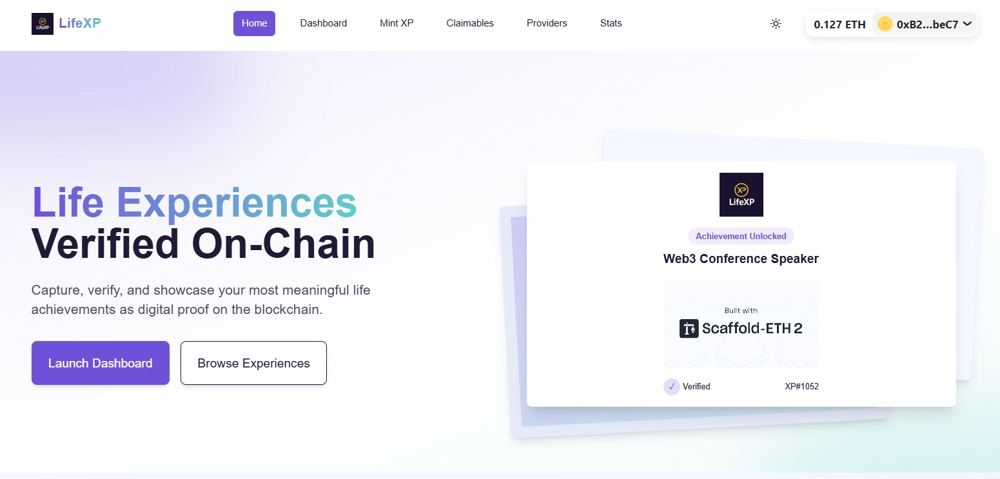
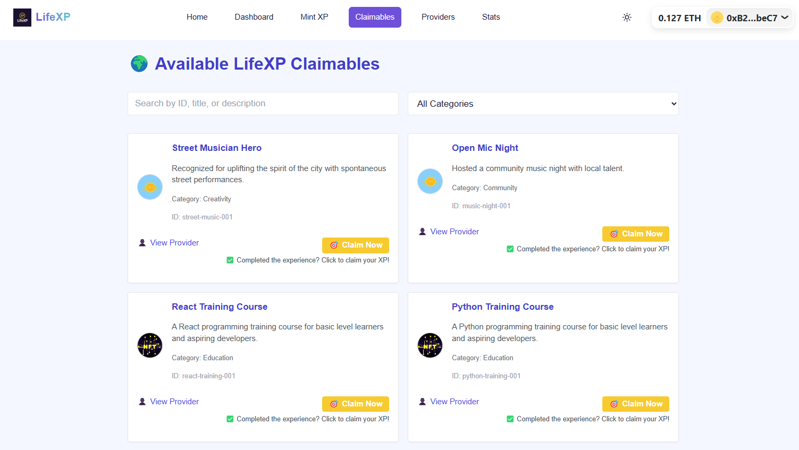

# Screenshots Overview – LifeXP Public Repo

This folder contains UI screenshots of the LifeXP decentralized application, demonstrating real-world use of the LifeXP brand and platform for governance, transparency, and trademark filing purposes.

Each screenshot shows a different view of the MVP application as deployed via Vercel in 2025.

---

## 📸 Screenshot Descriptions

### 🖼 lifexp-home.jpg

* **What it shows**: LifeXP homepage
* **Why it's important**: Demonstrates brand usage, slogan, and onboarding call-to-action. Shows the trademark in commercial use.

### 📊 lifexp-dashboard.png

* **What it shows**: Logged-in user dashboard with XP token list
* **Why it's important**: Shows real-world interaction with the product, including categories, token metadata, and the connected wallet interface.

### 🎯 lifexp-claimables.png

* **What it shows**: Public view of claimable XP tokens
* **Why it's important**: Demonstrates LifeXP’s marketplace-like features and engagement between providers and LifeXPers.

### 🔍 lifexp-tokendetail.png

* **What it shows**: Token detail modal with full metadata display
* **Why it's important**: Useful for illustrating the core function of LifeXP — minting and displaying verifiable experiences on-chain.

---

These files may be submitted as trademark specimens under Class 9 and Class 42, and also serve as public transparency assets for LifeXP DAO.
